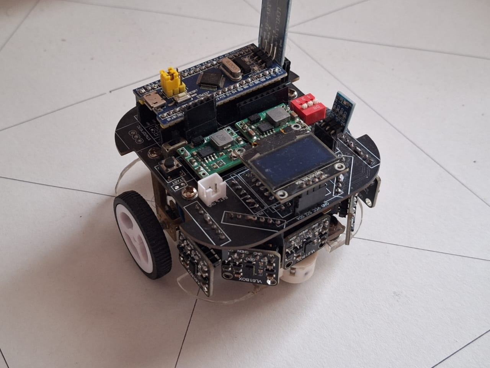
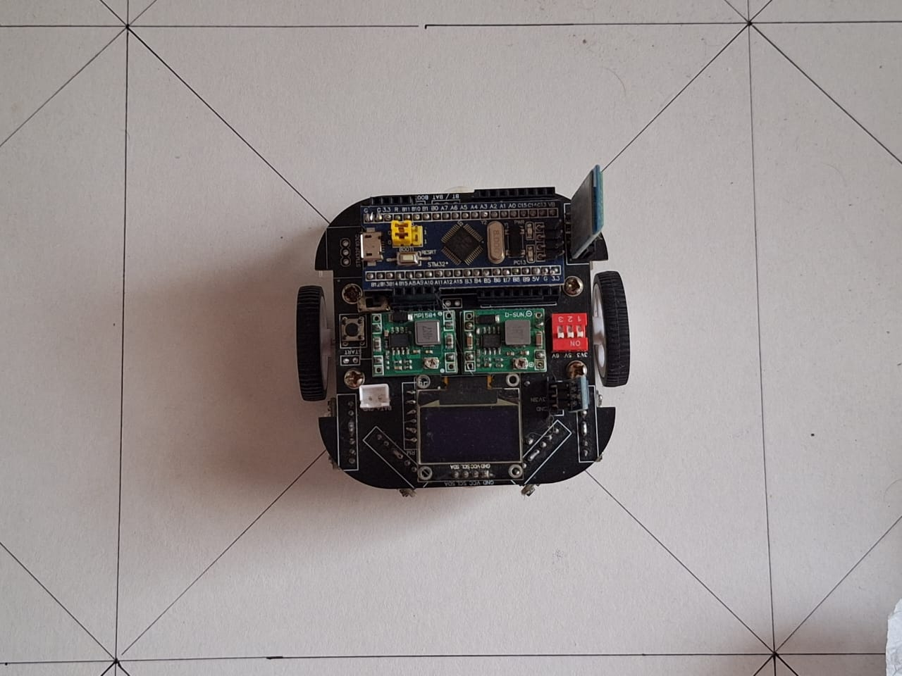
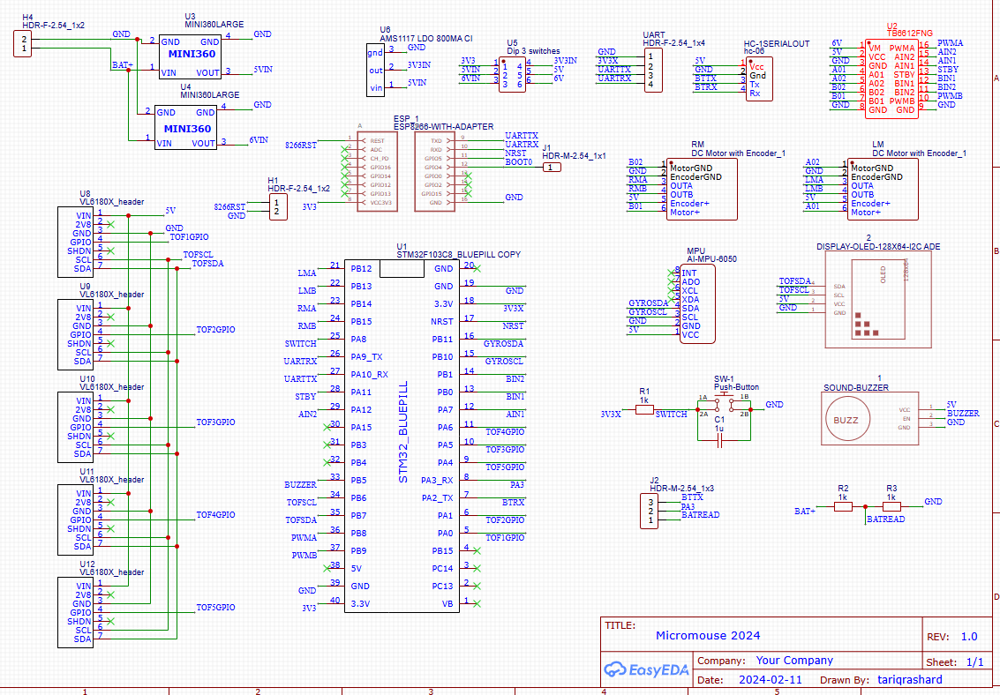
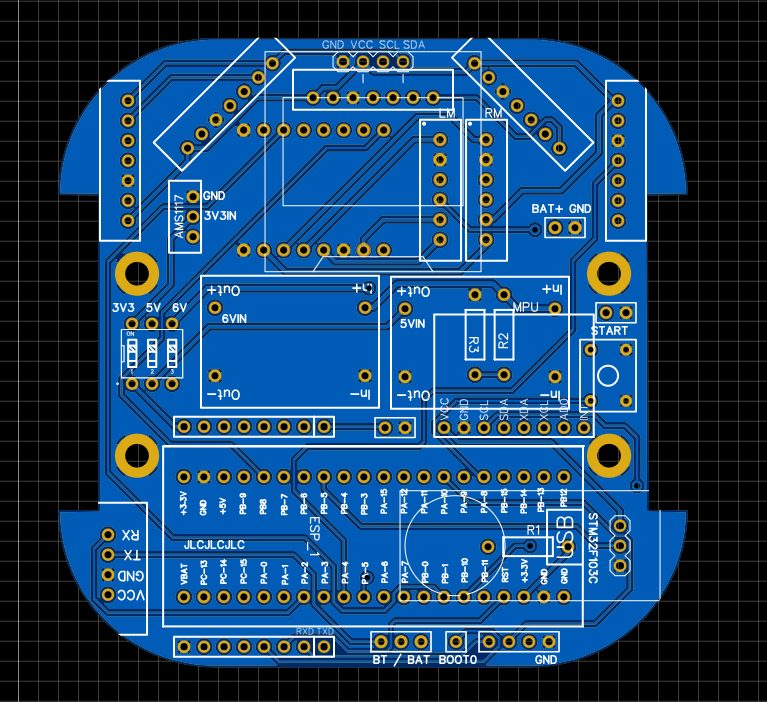
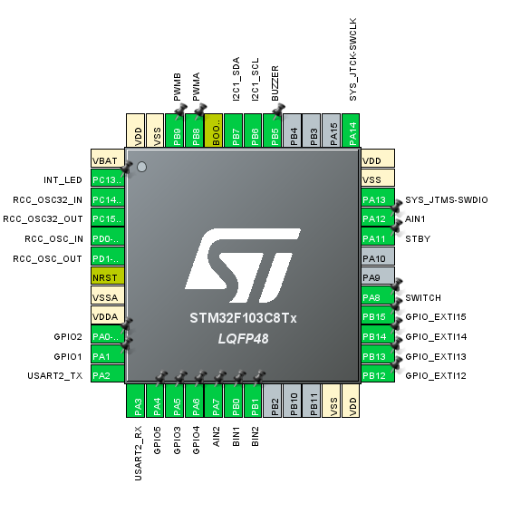

# Micromouse Robot Project

A Micromouse is a small autonomous robot designed to navigate a maze as quickly as possible. This repository details a Micromouse project built with the following key components:

- STM32F103C8T6 microcontroller (commonly referred to as the “Blue Pill” board)
- VL6180X ToF (Time-of-Flight) distance sensors (five in total)
- TB6612FNG motor driver
- N20 motors with encoders
- HC-05 Bluetooth module
- STM32CubeIDE for firmware development

## Table of Contents
- Overview
- Hardware
  - STM32F103C8T6
  - VL6180X ToF Sensors
  - TB6612FNG Motor Driver
  - N20 Motors with Encoder
  - HC-05 Bluetooth Module
- Software & STM32CubeIDE
  - Sensor Positioning
  - Limitations
  - Future Improvements
- License

### Overview

This Micromouse robot is designed to traverse a maze by detecting walls in its current cell and in the cell ahead. The firmware runs on an STM32F103C8T6 microcontroller, using data from five VL6180X Time-of-Flight (ToF) sensors to identify walls. Motor driving is handled by a TB6612FNG dual H-bridge driver, and N20 motors with encoders provide feedback for precise movement. An HC-05 Bluetooth module is included for wireless communication (e.g., debugging or control from a host device).

### Hardware

#### STM32F103C8T6
- A popular, low-cost ARM Cortex-M3 microcontroller board (often called the “Blue Pill”).
- Offers sufficient performance for sensor polling, motor control, and basic navigation algorithms.
- 72 MHz CPU, 20 KB RAM, 64 KB Flash.

#### VL6180X ToF Sensors
- Measures distance by sending out pulses of light and timing the reflections.
- Chosen because IR proximity sensors require complex calibration.
- Positions arranged so the robot can detect walls in the front cell and in the present cell.

#### TB6612FNG Motor Driver
- A dual H-bridge driver used to control two DC motors (in this case, the left and right N20 motors).
- Capable of forward, reverse, brake, and standby functions.

#### N20 Motors with Encoder
- Small, lightweight gearmotors that come with quadrature encoders for measuring rotation.
- Provides feedback for controlling speed and distance traveled (closed-loop control).

#### HC-05 Bluetooth Module
- Provides serial communication over Bluetooth, for debugging or remote control.

## Side View

## Top View

### PCB Design

EasyEDA was utilized as it is a bigger friendly pcb design suite and contains libraries for many components

## Schematic

## PCB

### Software & STM32CubeIDE

## STM32 Pinout

STM32CubeIDE is used for firmware development. This integrated tool provides:
- HAL (Hardware Abstraction Layer) libraries: Simplifies peripheral configuration, making code more hardware-portable.
- Automatic code generation for clock configuration, GPIO, timers, I2C, etc.
- Integrated debugging: Single-step debugging, breakpoints, and variable inspection with ST-LINK or equivalent.
- Peripheral initialization through a GUI (CubeMX perspective) to quickly enable features like PWM, I2C, and timers.
- VL6180X driver in C (adapted from Arduino library) to read distance values.
- Motor control: Using Timer PWM outputs on the STM32 to drive TB6612FNG pins, replicating an Arduino-style analogWrite().
- Wall PID or other sensor-based control loops, reading from the five VL6180X sensors.
- HC-05 for Bluetooth-based debugging/logging (via UART).

### Sensor Positioning

Initially placed so the robot can detect walls:
- In front of the next maze cell
- On the sides of the robot in the current cell
- Challenge: The VL6180X sensors are relatively slow to read, especially when you have five sensors. Attempting to read them all in real-time while running wall PID loops can limit performance.

### Limitations

- **Speed of VL6180X**: The VL6180X ToF sensor has a relatively slow sampling rate, making it difficult to poll all five sensors quickly.
- **Sensor Placement**: While the chosen positions allow the robot to detect walls in front and in the current cell, the slow read time can reduce reaction speed.
- **Simultaneous Read**: Running all five VL6180X sensors in parallel at high speed is not practical at the moment, impacting wall following accuracy.

### Future Improvements

- **Revised Sensor Placement**: Optimize sensor angles/positions for faster detection of upcoming walls with minimal sensor overhead.
- **Different Distance Sensor**: Consider faster ToF sensors or well-calibrated IR sensors that can be read more rapidly.
- **Hardware Upgrades**: Potentially move to a more powerful microcontroller or add sensor interrupt pins if needed for concurrency.
- **Algorithm Enhancements**: Explore improved filtering or sensor scheduling to handle the slow polling of VL6180X while still maintaining stable control loops.
